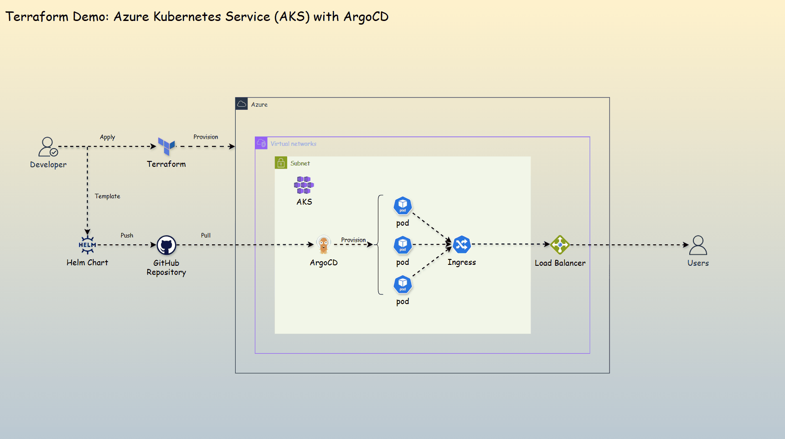
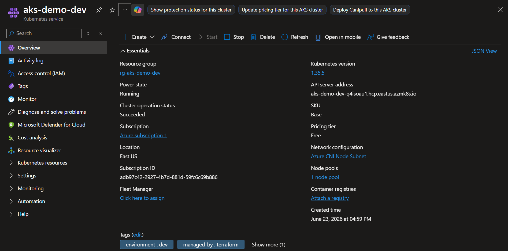
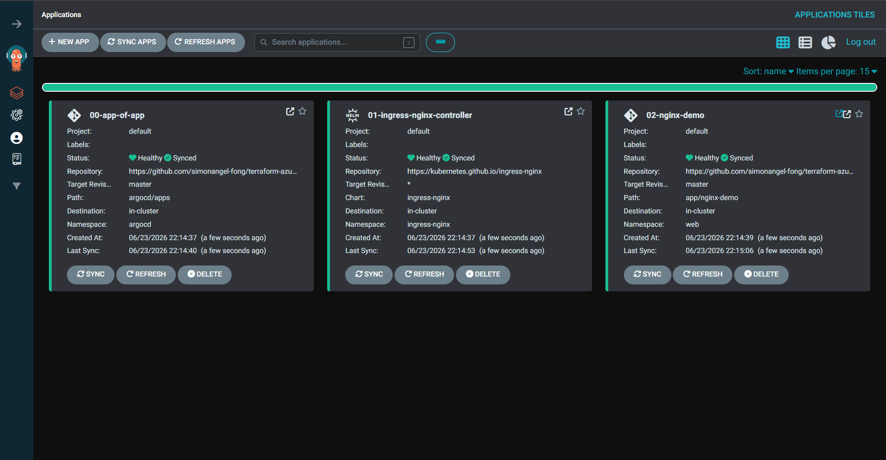
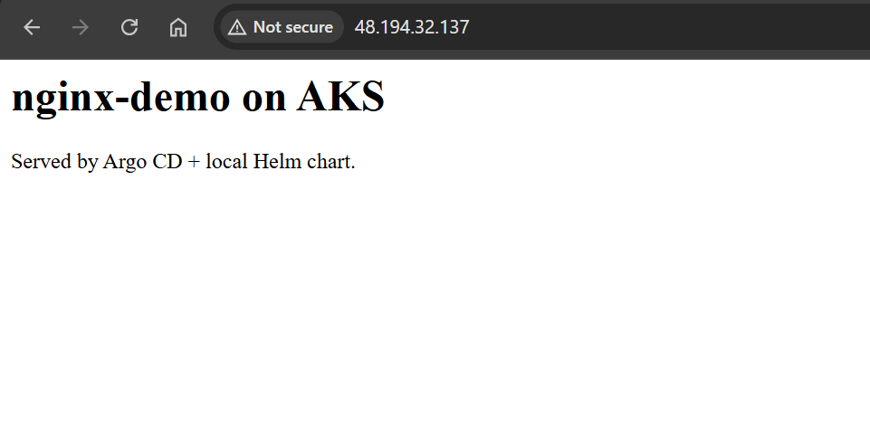

# Terraform Azure AKS + Argo CD (GitOps Demo)

> Provision an AKS cluster with Terraform, bootstrap Argo CD, and let an app-of-apps pattern deploy ingress-nginx and a sample web app from this repo.

 

---

## Diagram

---

## How it works

1. `Terraform` creates the `AKS cluster` and installs `Argo CD`.
2. Deploy the **app-of-apps** in `Argo CD`.
3. `Argo CD` reconciles every manifest against the cluster.
4. Pushing changes to trigger `Argo CD` to roll the workloads forward.

---

## Outcome

- **AKS cluster**

- **Argo CD UI**

- **nginx-demo**

---
